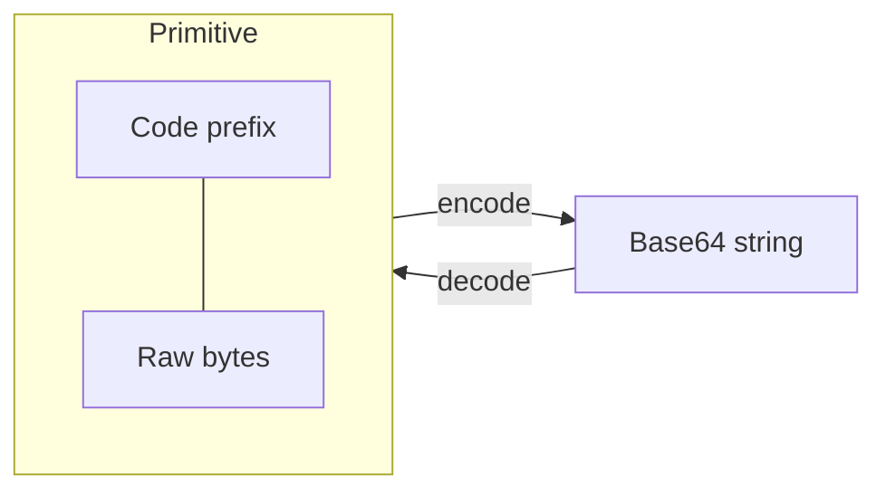
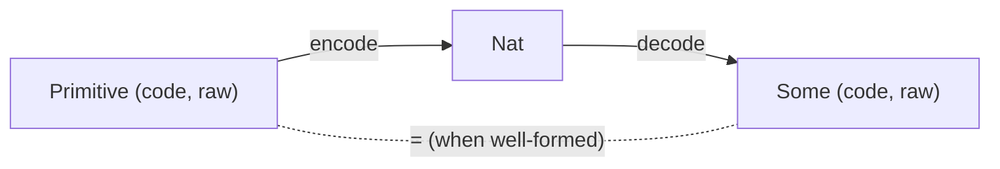

# CESR Encoding

**Module:** `KERI.CESR`

## What is CESR?

CESR (Composable Event Streaming Representation) is KERI's binary encoding format. Each primitive consists of a derivation code prefix followed by raw cryptographic material, all Base64-encoded to a fixed total length.

## Derivation codes

| Code | Prefix length | Raw size (bytes) | Total length (Base64 chars) |
|------|--------------|-------------------|----------------------------|
| `Ed25519PubKey` | 1 | 32 | 44 |
| `Blake2bDigest` | 1 | 32 | 44 |
| `Ed25519Sig` | 2 | 64 | 88 |

## Invariants

### Size consistency

Each derivation code determines exact sizes. The formalization proves these as definitional equalities:

- `ed25519_pub_total_length` — Ed25519 public key is 44 characters
- `blake2b_digest_total_length` — Blake2b digest is 44 characters
- `ed25519_sig_total_length` — Ed25519 signature is 88 characters

### Construction validity

`mkPrimitive` is the only way to construct a `Primitive`. It checks that the raw material size matches the derivation code:

**`primitive_size_valid`**: `mkPrimitive c r` succeeds if and only if `r.len = rawSize c`.

This prevents malformed primitives from entering the system.

### Roundtrip property

**`roundtrip`**: For any well-formed primitive, `decode(encode(p)) = p`.

This is axiomatized (since encode/decode are opaque) but the axiom requires the size precondition, ensuring only valid primitives roundtrip.

### Code uniqueness

**`code_lengths_distinct`**: Different derivation codes have distinguishable prefixes (specifically, `Ed25519Sig` has code length 2 while `Ed25519PubKey` has code length 1).
