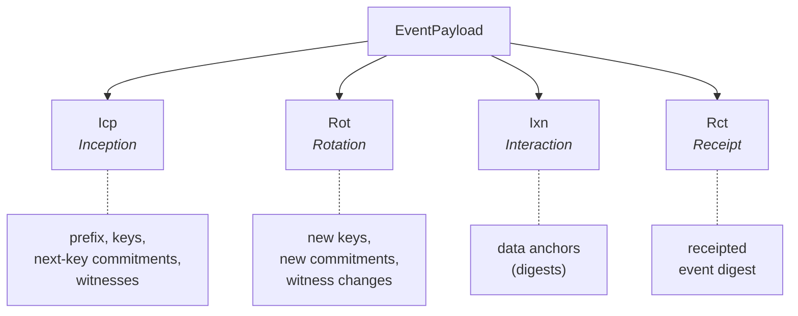

# Event Structure

**Module:** `KERI.Event`

## Generic KEL events

The `KELEvent` structure is parameterized over a payload type `α`, making it reusable across different KERI-based protocols:

```
structure KELEvent (α : Type) where
  sequenceNumber : Nat
  priorDigest : Option Digest
  payload : α
  signer : Key
  signature : Signature
```

A `KEL α` is simply `List (KELEvent α)`, stored newest-first.

This structure was originally defined in kelgroups and is extracted here so any KERI-based project can import it.

## KERI event payloads



| Type | Purpose | Key fields |
|------|---------|------------|
| **Icp** (Inception) | Establish new identifier | prefix, keys, next-key commitments, witnesses |
| **Rot** (Rotation) | Rotate keys | new keys, new next-key commitments, witness changes |
| **Ixn** (Interaction) | Anchor external data | data anchors (digests) |
| **Rct** (Receipt) | Witness receipt | receipted event digest |

### Inception

Creates a new KERI identifier. Fields:

- `prefix` — the SAID (self-addressing identifier), computed as the digest of the inception event itself
- `signingThreshold` — minimum signatures required (multi-sig)
- `keys` — current signing key set
- `nextThreshold` / `nextKeys` — pre-rotation commitments for the next key set
- `witnessThreshold` / `witnesses` — witness configuration

### Rotation

Replaces the current key set with previously committed next-keys. Supports witness configuration changes.

### Interaction

Anchors arbitrary data (as digests) to the KEL without changing keys. Used for binding external events to the identifier's timeline.

### Receipt

A non-transferable witness receipt. Does not modify key state.

## Invariants

- **`inception_type`** / **`rotation_type`** — `eventType` correctly classifies payloads
- **`prefix_consistent_icp`** / **`prefix_consistent_rot`** — `eventPrefix` extracts the prefix field from any payload variant
