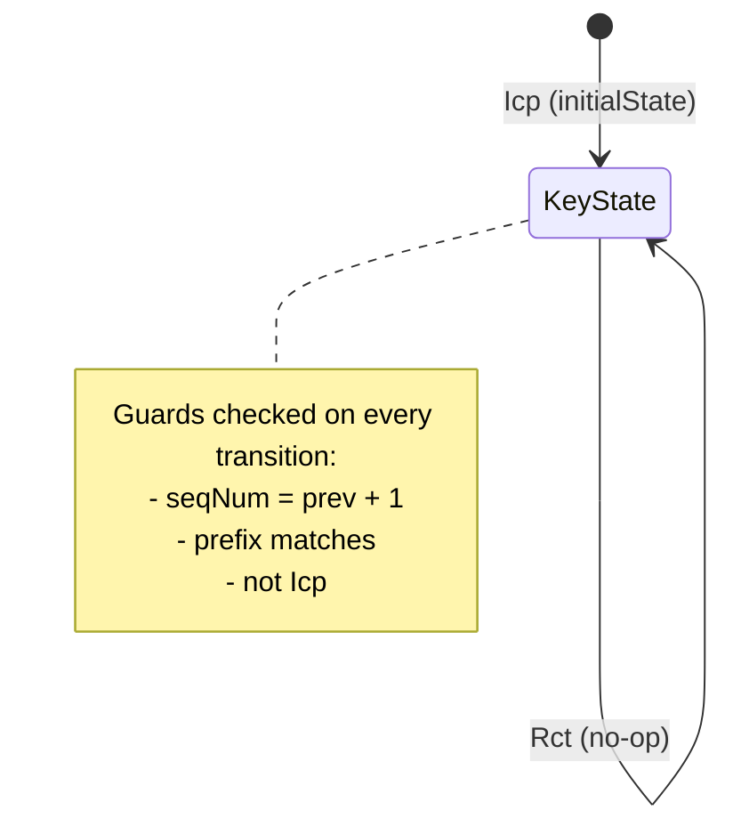
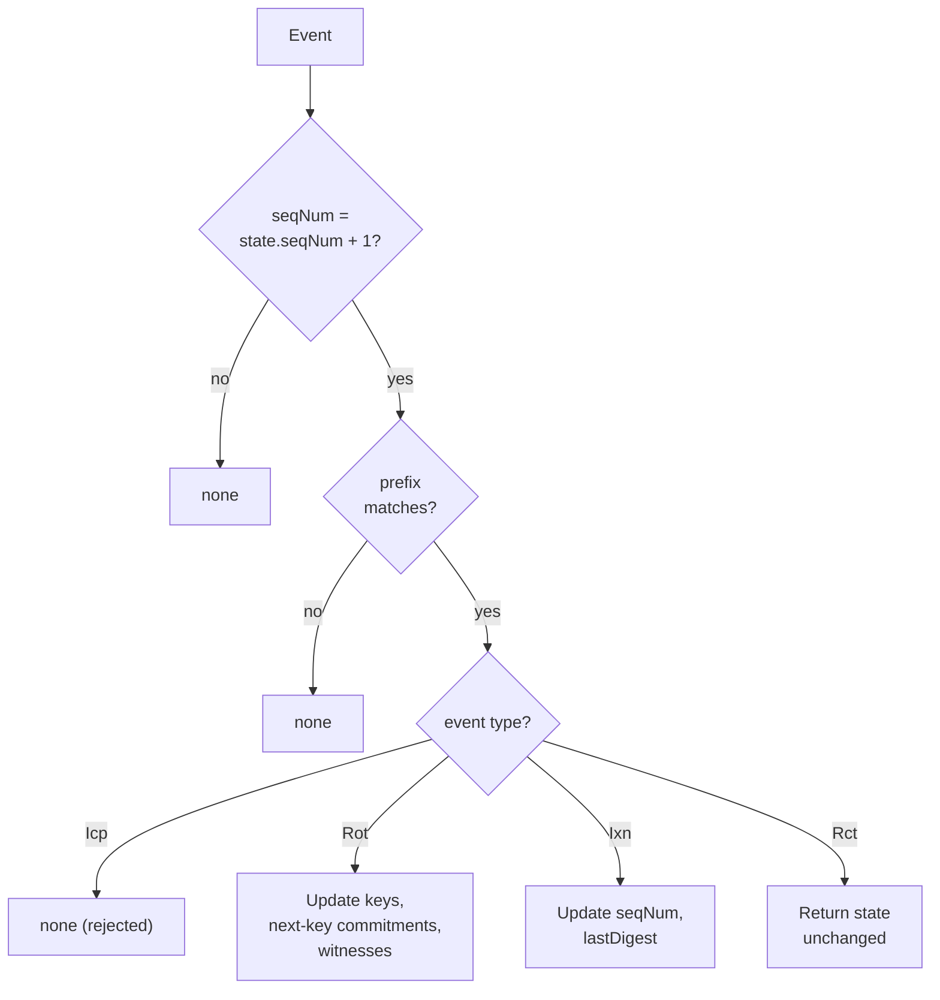

# Key State Machine

**Module:** `KERI.KeyState`

## Key state

The key state is the cumulative result of processing a KEL from inception through all subsequent events:

| Field | Type | Meaning |
|-------|------|---------|
| `prefix` | SAID | Identifier (immutable after inception) |
| `sequenceNumber` | Nat | Current sequence number |
| `lastDigest` | Digest | Digest of the most recent event |
| `signingThreshold` | Nat | Required signature count |
| `keys` | List Key | Current signing keys |
| `nextThreshold` | Nat | Threshold for next key set |
| `nextKeys` | List Digest | Commitments to next keys |
| `witnessThreshold` | Nat | Required witness receipt count |
| `witnesses` | List Key | Current witness set |

## State transitions

### `initialState`

Creates the initial key state from an inception event. Requires:

- Sequence number = 0
- No prior digest

### `applyEvent`

Applies a non-inception event to an existing state. Validates:

1. Sequence number = current + 1
2. Prefix matches
3. Event type is not inception

Then updates the state according to the event type:

- **Rotation**: replaces keys, next-key commitments, updates witnesses
- **Interaction**: increments sequence number, updates last digest
- **Receipt**: no-op (state unchanged)

## Proven invariants

### Initialization

- **`initial_state_seq_zero`** — The initial state always has sequence number 0
- **`initial_state_prefix`** — The initial state's prefix matches the inception event's prefix

### Transition guards

- **`apply_rejects_inception`** — You cannot apply an inception event to an existing state. Inception is only valid as the first event.
- **`apply_checks_sequence`** — A successful `applyEvent` requires `e.sequenceNumber = ks.sequenceNumber + 1`. Events cannot be applied out of order.
- **`apply_checks_prefix`** — A successful `applyEvent` requires the event's prefix to match the state's prefix. Events for a different identifier are rejected.

### State updates

- **`receipt_neutral`** — Receipt events leave the key state unchanged. They are acknowledgments, not mutations.
- **`apply_updates_sequence`** — For non-receipt events, a successful application increments the sequence number by exactly 1.
