# Invariant Overview

KERI's security rests on a small set of invariants that must hold across all event processing. This formalization makes them explicit and machine-checked.

## Module dependency graph

`Crypto` provides the abstract primitives. `Event` defines the generic event structure (shared with kelgroups). `KeyState`, `KEL`, and `PreRotation` build the KERI-specific invariants on top.

## Axiom / theorem boundary

**Axioms** are assumptions about the cryptographic layer that cannot be proven without a concrete implementation:

| Axiom | Module | Meaning |
|-------|--------|---------|
| `sign_verify` | Crypto | Signatures produced by `sign` are accepted by `verify` |
| `hash_deterministic` | Crypto | Hashing is a function |
| `commit_verify` | Crypto | `verifyCommitment(k, commitKey(k))` succeeds |
| `roundtrip_ax` | CESR | `decode(encode(p)) = p` for well-formed primitives |

**Theorems** are proven consequences that follow from the definitions and axioms:

| Count | Module | Examples |
|-------|--------|----------|
| 3 | Crypto | `sign_then_verify`, `commitment_verify_correct` |
| 7 | CESR | `ed25519_pub_total_length`, `roundtrip`, `primitive_size_valid` |
| 4 | Event | `inception_type`, `prefix_consistent_icp` |
| 6 | KeyState | `initial_state_seq_zero`, `apply_rejects_inception`, `receipt_neutral` |
| 5 | KEL | `singleton_chain_valid`, `kel_starts_with_inception`, `replay_inception_gives_initial` |
| 3 | PreRotation | `commit_verify_roundtrip`, `verify_prerotation_singleton` |

## Relationship to kelgroups

```mermaid
graph TD
    subgraph keri-lean["keri-lean (this repo)"]
        KE["KELEvent α"]
        HC["hashChainValid"]
        CR["Crypto types"]
    end
    subgraph kelgroups["kelgroups"]
        L1["L1 / L2 payloads"]
        GOV["Governance invariants"]
        FOLD["FoldInvariants"]
    end

    CR --> KE
    KE --> HC
    KE -->|"require keri"| L1
    HC -->|"require keri"| GOV
    L1 --> GOV
    GOV --> FOLD
```

The `KELEvent` structure and `hashChainValid` predicate were originally defined in kelgroups. This project extracts the generic KERI parts so that kelgroups (and any other KERI-based project) can depend on them via Lake's `require` mechanism.
